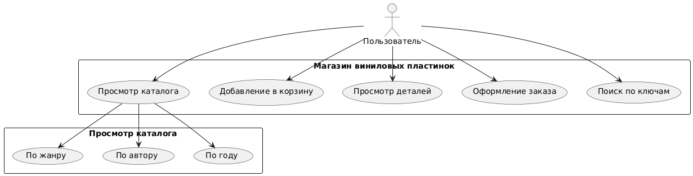
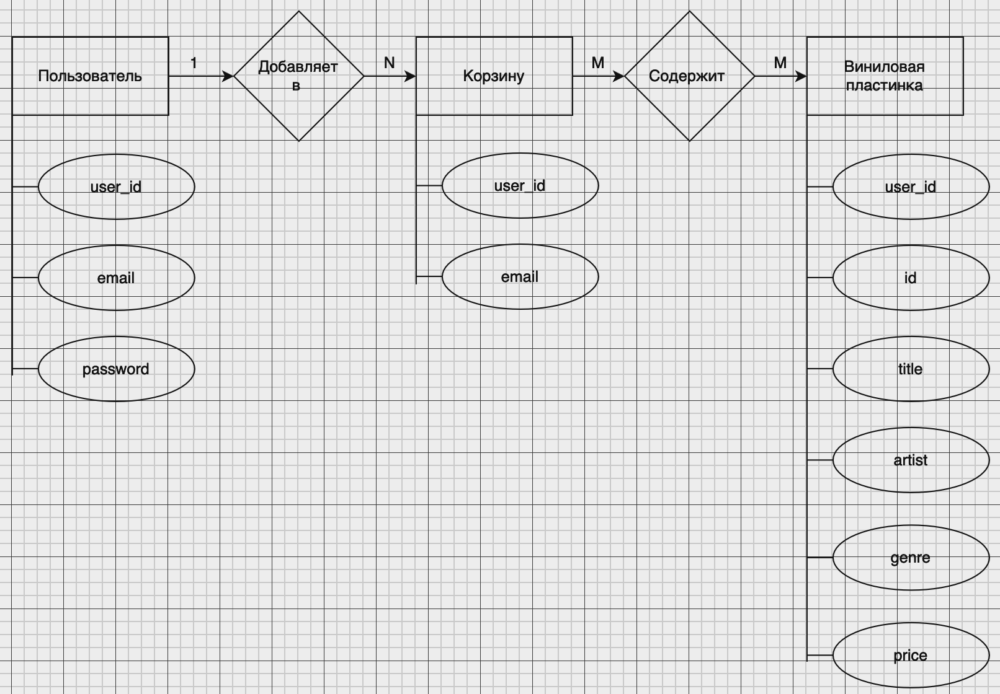
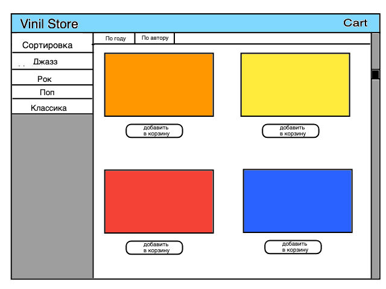
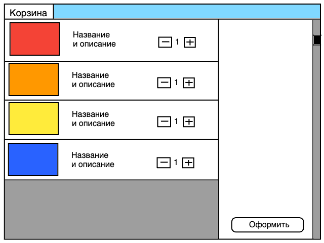

# Магазин виниловых пластинок

## Описание проекта
Магазин виниловых пластинок — это веб-приложение, позволяющее пользователям просматривать каталог виниловых пластинок, добавлять их в корзину и оформлять заказы. Пользователи могут легко находить и приобретать любимую музыку в удобном интерфейсе. Проект направлен на создание современного и интуитивно понятного инструмента для любителей виниловых пластинок, предоставляя возможность удобного поиска, фильтрации и покупки.

## Описание предметной области
Виниловые пластинки, несмотря на развитие цифровой музыки, остаются популярными среди ценителей качественного звука и коллекционеров. В современном мире многие пользователи ищут виниловые пластинки как способ насладиться уникальным звуком и физическим носителем. Веб-приложения для покупки виниловых пластинок упрощают этот процесс, предоставляя возможность легко находить и приобретать желаемые записи онлайн.

## Анализ аналогичных решений

| Критерий                   | Discogs          | Vinyl Me, Please | Amazon          |
|----------------------------|------------------|------------------|------------------|
| Удобство интерфейса        | Высокое          | Среднее          | Высокое          |
| Поддержка форматов         | Виниловые пластинки | Виниловые пластинки | CD, MP3, винил   |
| Наличие редких записей     | Высокое          | Среднее         | Низкое           |

## Функциональные требования
Приложение должно обеспечивать пользователям возможность:
- Просматривать каталог виниловых пластинок с различными фильтрами (по жанру, исполнителю и году выпуска).
- Добавлять виниловые пластинки в корзину.
- Просматривать детали каждого товара (описание, обложка, цена).
- Оформлять заказы на выбранные пластинки.
- Искать пластинки по ключевым словам.

## Use-Case диаграмма

## ER-диаграмма сущностей

## Пользовательские сценарии
1. **Добавление пластинки в корзину**
   - Пользователь заходит на страницу каталога.
   - Выбирает понравившуюся пластинку.
   - Нажимает на кнопку «Добавить в корзину».
   - Приложение подтверждает успешное добавление пластинки в корзину.

2. **Оформление заказа**
   - Пользователь открывает страницу корзины.
   - Проверяет добавленные товары и их количество.
   - Нажимает кнопку «Оформить заказ».
   - Заполняет контактные данные и адрес доставки.
   - Подтверждает заказ, получая уведомление об успешном оформлении.

3. **Просмотр деталей пластинки**
   - Пользователь заходит на страницу каталога.
   - Нажимает на изображение пластинки, чтобы просмотреть детали.
   - Видит информацию об исполнителе, жанре, годе выпуска и описании.
   - При необходимости добавляет товар в корзину.

## Экраны будущего web-приложения

### Экран 1: Главная страница
- Заголовок приложения и поле для поиска.
- Каталог с миниатюрами обложек пластинок.
- Фильтры для поиска по жанру, исполнителю и году выпуска.
- Кнопка для доступа к корзине.

### Экран 2: Корзина
- Заголовок «Корзина».
- Список всех добавленных товаров с миниатюрами.
- Кнопка «Оформить заказ».
- Возможность удаления товаров из корзины.

### Эскизы интерфейса
- Главная страница

- Корзина

